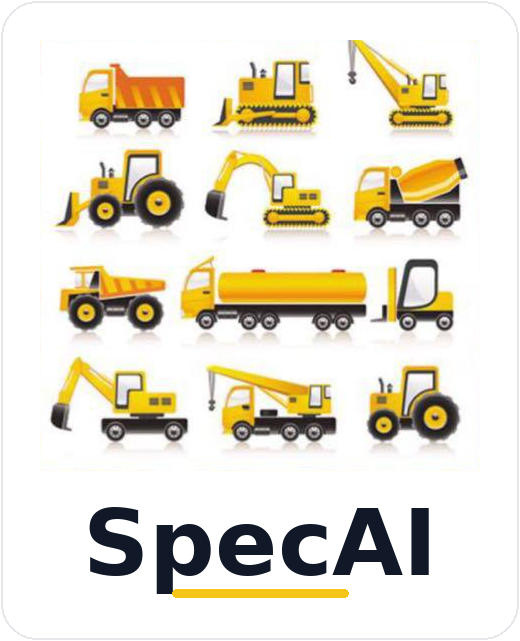

<p align="center">
  
</p>

# SpecAI
Маркетплейс аренды спецтехники (краны, экскаваторы, самосвалы и т.д.) для строительной отрасли. Целевые города запуска: Набережные Челны, Нижнекамск, Елабуга, Заинск.

## Статус

Приложение подключено к **реальному Firebase-проекту `specai-dev`**:

- Реальная SMS-авторизация (Firebase Phone Auth)
- Реальное хранилище заказов/откликов/чата (Cloud Firestore, правила безопасности задеплоены)
- Если Firebase недоступен (нет сети, не настроен) — приложение автоматически откатывается
  в демо-режим (`lib/data/demo_data_store.dart`) с моковой авторизацией, чтобы никогда не
  падать в белый экран

Исполнители на карте (цена/статус) пока остаются демо-данными — реальных аккаунтов
исполнителей (второй стороны рынка) ещё нет, это следующий шаг развития.

**Важно:** реальный вход по SMS не протестирован end-to-end из этой сессии — здесь нет
доступа к телефону, чтобы принять код. Проверьте сами на живом сайте
(https://maratgalin1986-blip.github.io/SpecAI/) со своим номером. Если авторизация не
пройдёт — самая частая причина: в Firebase Console → Authentication → Sign-in method
провайдер "Phone" не включён (по вашим заметкам из прошлой сессии он должен быть уже
включён для этого проекта).

## Запуск

```bash
flutter pub get
flutter run -d chrome
```

## Архитектура бэкенда

- `lib/data/app_data_store.dart` — общий интерфейс `AppDataStore`
- `lib/data/firebase_data_store.dart` — реальная реализация (Firebase Auth + Firestore)
- `lib/data/demo_data_store.dart` — офлайн-fallback реализация того же интерфейса
- `lib/main.dart` выбирает реализацию при старте: пробует Firebase, при ошибке/таймауте (8 сек) — демо
- `firestore.rules` — заказчик управляет только своими заказами/откликами/чатом

## Монетизация (заложено, не активировано)

- Комиссия с исполнителей: `kCommissionRatePercent` (сейчас только отображается,
  реальное списание не реализовано).
- Приём донатов от заказчиков — заглушка на экране профиля.
- Приём платежей (карты/СБП) **не подключён**: платёжный шлюз нужно интегрировать отдельно,
  когда будет выбран провайдер (ЮKassa/Тинькофф и т.п.).

## Логотип

Фирменный знак — набор иконок спецтехники (экскаватор, кран, самосвал и т.д.) с подписью
SpecAI. Исходное изображение: `assets/logo/original/logo-source.jpg`. Из него собраны:
`assets/logo/png/logo-full.png` — полная витрина техники с подписью (экран входа), и
`assets/logo/png/icon-*.png` — квадратная иконка (экскаватор на тёмно-синей плашке) для
иконок приложения (Android/iOS/web) и шапки экрана.
